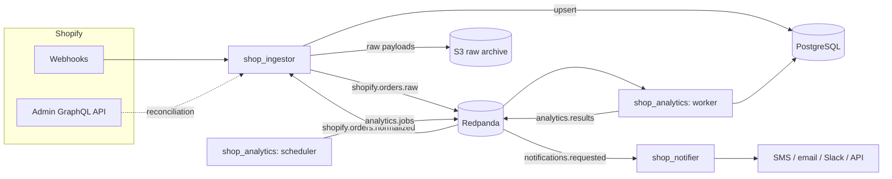

# Architecture

## What this platform does today

For a configurable date range, determine sales grouped by direct Shopify sales vs. Shopify
Collective sales, further broken down by Collective partner — delivered first as a
text/SMS-style summary. That's it. Everything else described here exists to make that one
answer trustworthy, replayable, and cheap to run, while not blocking the platform from
growing into the four-phase vision below.

## Product phases (where we are: Phase 1)

```
Phase 1: "What happened?"        <- current scope
Phase 2: "Why did it happen?"
Phase 3: "What should I do?"
Phase 4: "Do it for me."
```

Shopify-specific objects are normalized into canonical `commerce.*` events (see
[event-model.md](event-model.md)) specifically so Phase 2+ integrations (QuickBooks,
Stripe, Meta/Google Ads, Klaviyo, ShipStation, GA4, other commerce platforms) can plug into
the same event model later without a rewrite.

## System overview



## Service decomposition

Four logical responsibilities, three deployable Go services, one shared library — not six
one-per-job microservices:

- **`shop_ingestor`** — webhook receiver + reconciliation + normalization. These three
  share the Shopify API client and channel/partner classification logic; splitting them
  would just mean synchronized releases every time Shopify's schema shifts.
- **`shop_analytics`** — scheduler + generic analytics worker framework + jobs (starting
  with `sales.channel.breakdown`). The scheduler only emits work onto `analytics.jobs`; it
  never computes analytics itself.
- **`shop_notifier`** — consumes `notifications.requested`, formats, delivers via a
  vendor-agnostic interface. Decoupled from analytics logic entirely — notifier doesn't
  know what a "sales breakdown" is, only how to render and send a result.
- **`shop_platform`** — no deployment, just the Go module the other three import.

## Data ownership

```
Shopify     — authoritative upstream commerce source
S3          — durable raw event archive (replay source of truth)
PostgreSQL  — normalized current state + analytics state
Redpanda    — transport only, not source of truth
```

If Redpanda is lost entirely, the platform is reconstructable from S3 (raw archive) and
Shopify (reconciliation) — see [disaster-recovery.md](disaster-recovery.md).

## MVP compromises (explicit, not accidental)

| Compromise | Why | Upgrade path |
|---|---|---|
| Single Redpanda broker | Cost; not the source of truth so loss is recoverable | 3+ broker cluster or Redpanda Cloud when a second tenant can't tolerate ingestion downtime |
| Single-AZ RDS | Cost | Multi-AZ + read replica before onboarding a tenant with real uptime requirements |
| Single NAT Gateway | Cost (~$33/mo vs. ~$65+/mo for 2 AZs) | One NAT per AZ if the shared cluster's other workloads need it |
| No dedicated CMKs (AWS-managed keys only) | Every CMK is a fixed monthly cost | Add CMKs for data requiring stronger key-rotation guarantees |
| Self-hosted, short-retention observability | Cost — no AMP/AMG | Longer retention / managed services once query volume justifies it |
| Pure API EKS auth mode, EKS Pod Identity | Simpler than IRSA, current AWS best practice | N/A — this is the recommended direction, not a compromise to reverse |

See [cost-model.md](cost-model.md) for the dollar figures behind these calls.
